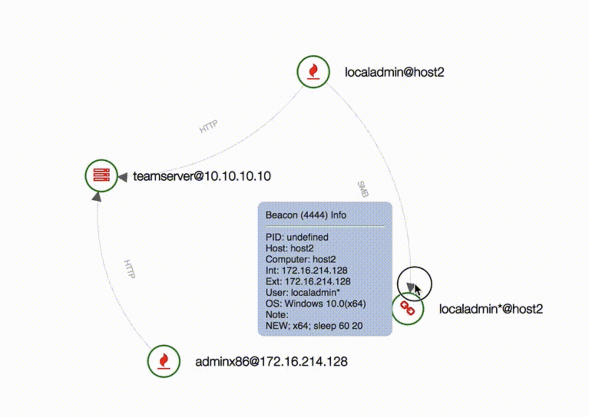

# Beacon web view

NOTE: This is early test code. It works, but may need tuning for production

Display beacons in a graphical web view

Uses a python3 script to convert the exported CSV to the JSON needed for for the web view display

Requires the csv and json modules

## Features

- CSV to JSON for D3 graph processing
- Displays link relationship (HTTP/SMB) for connected beacons
- Highlights linked beacon
- Hover over displays beacon info

## Quickstart

0) Save the source in the same directory as CobaltStrike.

Yes this is bad, but like I said, this is early test code.

1) Import the script

    import make_webview.cna

2) Use the script console to export the data

    make_webview

3) Start web server in webview directory

    python3 -m http.server 8000

4) Browse the local web server

    http://localhost:8000/beacons.html

